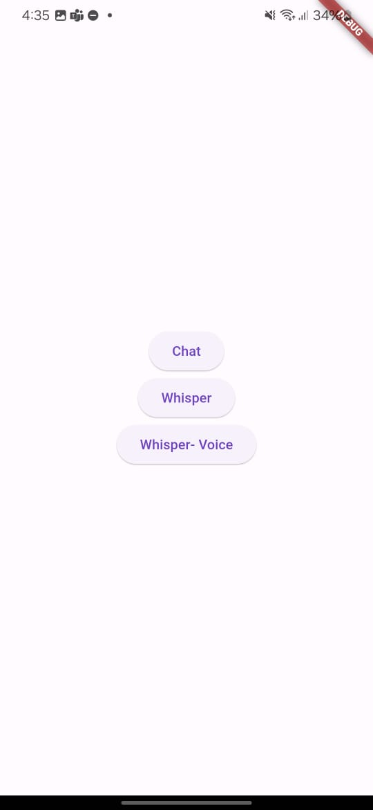
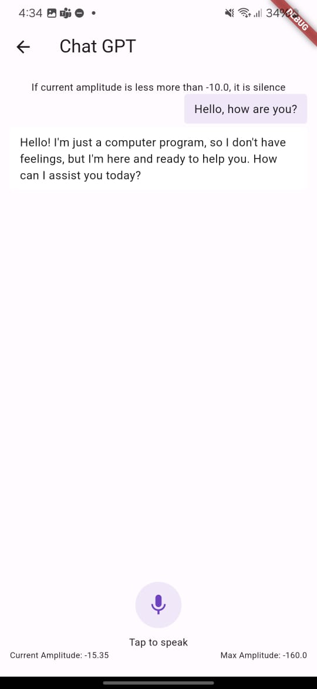
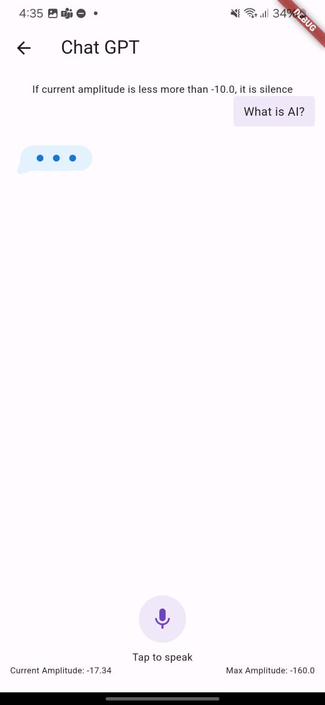
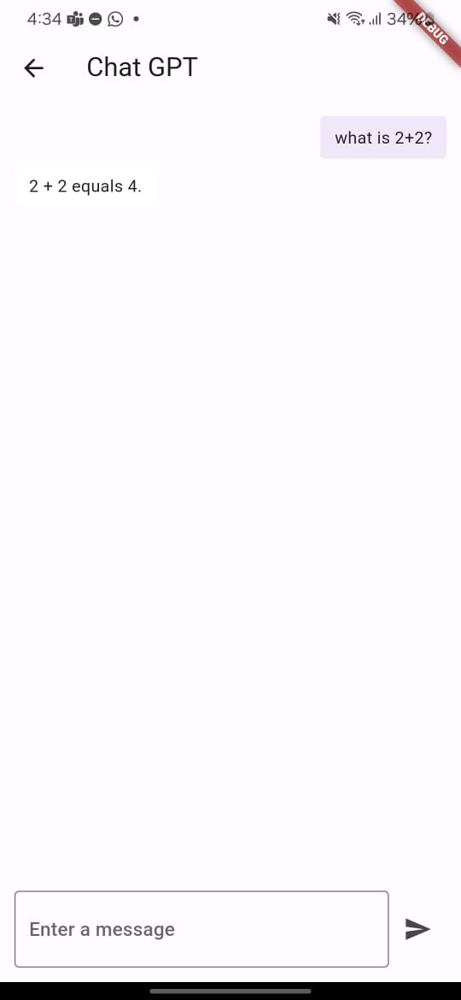

# open_ai_test

A simple poc app for ChatGPT experiment

## Getting Started

Create `.env` file in root folder and paste your api key
```
OPEN_AI_API_KEY="YOUR_API_KEY"
```

```shell
flutter pub run build_runner build
```

### POC
1. Text to Text
2. Speech To Text (STT)
3. Text to Speech (TTS)







